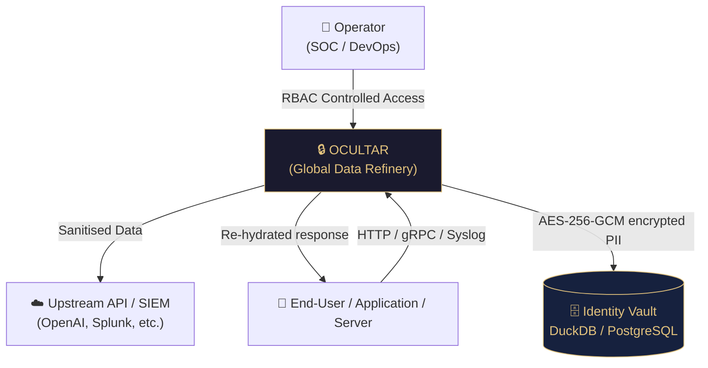
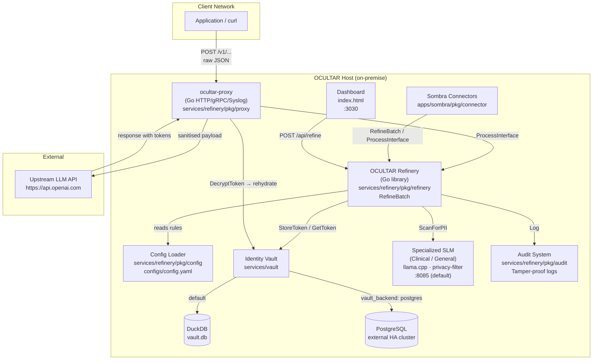
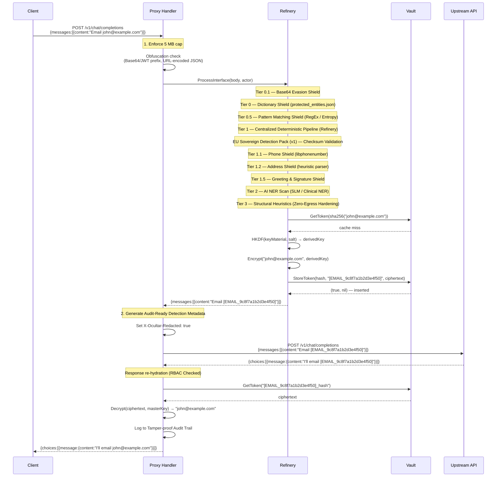
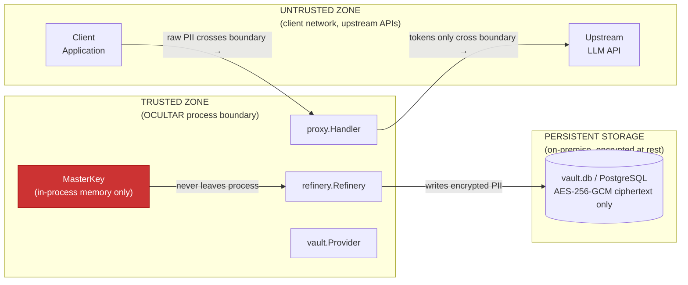
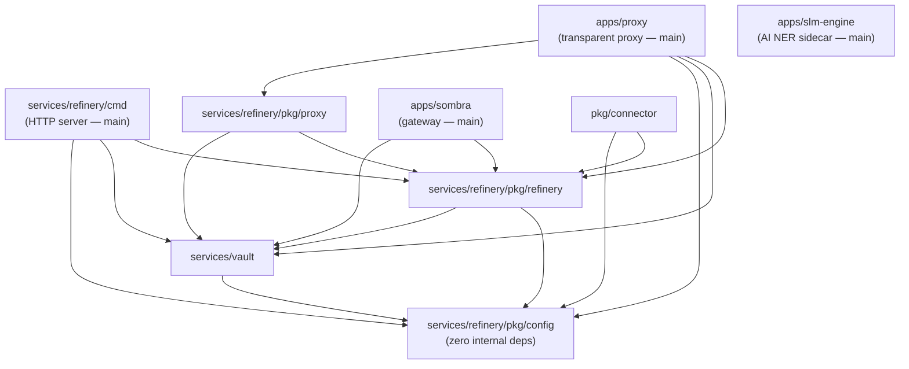

# OCULTAR | Architecture Reference

> **Audience:** Solutions architects, security auditors, and developers who need a precise understanding of how OCULTAR processes data, where trust boundaries lie, and how components interact.

---

## Table of Contents

1. [System Context (C4 Level 1)](#1-system-context-c4-level-1)
2. [Container Diagram (C4 Level 2)](#2-container-diagram-c4-level-2)
3. [Refinery Pipeline — Data Flow](#3-refinery-pipeline--data-flow)
4. [Security Trust Boundaries](#4-security-trust-boundaries)
5. [Package Dependency Graph](#5-package-dependency-graph)
6. [Cryptographic Design](#6-cryptographic-design)
7. [Vault Schema](#7-vault-schema)
8. [Fail-Closed Guarantees](#8-fail-closed-guarantees)
9. [Scalability & Concurrency Model](#9-scalability--concurrency-model)

---

## 1. System Context (C4 Level 1)

Who uses OCULTAR, and what external systems does it touch?



**Zero-Egress guarantee:** PII never flows to `Upstream API` — only tokens do. The vault lives entirely on-premise.

---

## 2. Container Diagram (C4 Level 2)

Internal services and how they communicate:



---

## 3. Refinery Pipeline — Data Flow

A single request through the OCULTAR proxy, showing every processing step:



---

## 4. Security Trust Boundaries



**What NEVER leaves the trusted zone:**
- Plain-text PII
- The `OCU_MASTER_KEY` value
- Decrypted vault contents

**What MAY leave the trusted zone:**
- Token strings (e.g. `[EMAIL_9c8f7a1b2d3e4f50]`) — these are safe; reversible only with the vault + master key.
- Structured audit log entries (token strings only, never PII).

---

## 5. Package Dependency Graph



**Key architecture rules:**
1. `services/refinery/pkg/config` has zero internal dependencies — it is the root of the dependency tree.
2. `services/refinery/pkg/refinery` does **not** import `services/refinery/pkg/proxy` — the refinery knows nothing about HTTP.
3. `services/vault` does **not** import `services/refinery/pkg/refinery` — storage is decoupled from redaction logic.
4. There is no `dist/` Go package — `dist/` contains compiled release artifacts (zip + signature files), not source modules.

---

## 6. Cryptographic Design

### Key Derivation

```
OCU_MASTER_KEY (env var, arbitrary string)
        │
        ▼
   HKDF-SHA256(keyMaterial, salt, info)
        │
        ▼
   32-byte AES key  ──► used for Encrypt() / Decrypt()
```

Both the **OCULTAR Proxy** and the **Sombra Gateway** use **HKDF-SHA256** (with a fixed salt) for strong key separation.

### Token Generation

Two token formats coexist in the system:

**Path A — Hash token (default)**

```
original PII: "john@example.com"
        │
        ▼
  HMAC-SHA256(key, "john@example.com")
  = 9c8f7a1b2d3e4f50a1b2c3d4e5f6a7b8...  (full 64-char hex)
        │
        ├──► Token: [EMAIL_9c8f7a1b2d3e4f50]   ← first 16 hex chars (safe to expose)
        │
        └──► Hash (full 64 chars): lookup key in vault table
```

**Path B — Entity token (operator-registered names)**

```
operator seeds: "John Doe" with variants ["John", "Doe", "J. Doe"]
        │
        ▼
  canonical_entities: id = "PERSON_1"   ← sequential integer
        │
        ├──► Token: [PERSON_1]          ← numeric suffix, not a hash
        │
        └──► canonical_name stored as plaintext in canonical_entities
```

The refinery checks Path B first for PERSON-class entity types. If the variant is found in `entity_variants`, the canonical token is returned immediately — no hash computation, no AES encryption. Path A is the fallback for all unregistered names and all non-PERSON types.

| Format | Example | Rehydration |
|---|---|---|
| Hash token | `[EMAIL_9c8f7a1b2d3e4f50]` | AES-256-GCM decrypt from `vault` table |
| Entity token | `[PERSON_1]` | Direct lookup from `canonical_entities` — no decryption |

**Determinism (Path A):** The same PII always produces the same hash token — relational integrity is preserved across records. **Stability (Path B):** The same canonical name always produces the same numeric token — operator-seeded identities are stable across sessions and restarts.

### AES-256-GCM Ciphertext Format

```
hex_encoded(
    random_nonce (12 bytes, crypto/rand)
    ||
    gcm.Seal(nonce, nonce, plaintext, nil)  ← 16-byte auth tag appended by GCM
)
```

Total overhead per PII value: 12 bytes (nonce) + 16 bytes (auth tag) = 28 bytes of overhead, hex-encoded to 56 extra characters on top of the plaintext length.

### Storage Layout

| Column | Type | Content |
|---|---|---|
| `pii_hash` | TEXT (PK) | Full HMAC-SHA256 hex of original PII — lookup key |
| `token` | TEXT | `[TYPE_XXXXXXXX]` string — safe to expose |
| `encrypted_pii` | TEXT | Hex-encoded AES-256-GCM ciphertext |

---

## 7. Vault Schema

### DuckDB (default)

```sql
-- Core token vault — one row per unique PII value
CREATE TABLE IF NOT EXISTS vault (
    pii_hash      TEXT PRIMARY KEY,
    token         TEXT NOT NULL,
    encrypted_pii TEXT NOT NULL
);

-- Entity Registry (Path 3) — one row per canonical identity
CREATE TABLE IF NOT EXISTS canonical_entities (
    id             VARCHAR PRIMARY KEY,       -- "PERSON_1", "ORGANIZATION_2"
    entity_type    VARCHAR NOT NULL,          -- "PERSON", "ORGANIZATION"
    canonical_name VARCHAR NOT NULL UNIQUE,   -- "John Doe"
    created_at     TIMESTAMP DEFAULT current_timestamp
);

-- Entity name variants — many variants map to one canonical entity
CREATE TABLE IF NOT EXISTS entity_variants (
    variant_name VARCHAR PRIMARY KEY,   -- "John", "Doe", "J. Doe"
    canonical_id VARCHAR NOT NULL,      -- references canonical_entities.id
    created_at   TIMESTAMP DEFAULT current_timestamp
);
CREATE INDEX IF NOT EXISTS idx_ev_canonical_id ON entity_variants(canonical_id);
```

Single file at `vault.db`. Zero external dependencies. DuckDB is configured with `SetMaxOpenConns(1)` — all writes are serialised through a single connection (safe for `canonical_entities` sequential ID generation). `LookupVariant` uses `WHERE LOWER(variant_name) = LOWER(?)` for case-insensitive matching.

### PostgreSQL

Same three tables created at startup via `CREATE TABLE IF NOT EXISTS`. The `entity_variants.canonical_id` foreign key uses `ON CONFLICT DO NOTHING` for idempotent seeding. Connection string via `postgres_dsn` in `config.yaml`. Connection pool capped at 15 (`sync.Semaphore` in `services/refinery/pkg/proxy`) to prevent exhaustion.

---

## 8. Fail-Closed Guarantees

OCULTAR enforces fail-closed at every critical junction:

| Failure scenario | OCULTAR behaviour |
|---|---|
| `protected_entities.json` missing or empty | `log.Fatal` — process refuses to start |
| `configs/config.yaml` contains invalid regex | `regexp.MustCompile` panics at startup — process refuses to start |
| Refinery error during redaction (any tier) | Proxy returns `500` — un-redacted body is **never forwarded** |
| Obfuscated payload detected (Base64/JWT prefix, URL-encoded JSON) | Refinery returns error → proxy returns `403` |
| SSRF attempt in `Ocultar-Target` header | `resolveTarget` returns error → proxy returns `403` |
| Payload exceeds configured limit | `MaxBytesReader` triggers → proxy returns `413` |
| Concurrency limit exceeded | Semaphore blocks for 10 seconds → `429` if not acquired |
| Token re-hydration key mismatch (key rotation) | Logs error, returns **token unchanged** (fail-safe — no data loss) |
| SLM inference fails | Refinery returns error → proxy returns `500` |

---

## 9. Scalability & Concurrency Model

### Concurrency limits

| Layer | Mechanism | Limit |
|---|---|---|
| Proxy (per instance) | `chan struct{}` semaphore | Configurable (Default: 10, Fallback: 15) |
| DuckDB | File-level lock | Single-process only |
| PostgreSQL (HA) | Connection pool (15 max) | Horizontally scalable |

### Horizontal scaling

| Mode | Scalable? | Notes |
|---|---|---|
| CLI / Dashboard | ✅ (per-process) | Each process uses its own `vault.db` — sharding by node. |
| Proxy (DuckDB) | ❌ | Single-node only; multiple proxy instances would use separate vaults. |
| Proxy (PostgreSQL) | ✅ | Multiple proxy instances can share a single PostgreSQL vault. Load-balance freely. |

### Memory model

- **Request bodies** are read fully into RAM before processing (Configurable cap enforced via `io.MaxBytesReader`).
- **File uploads** (`/api/refine/file`) use `bufio.Scanner` — line-by-line streaming. Memory overhead is bounded to a single line, not the file size.
- **SLM batch scan** marshals an entire JSON record to a string once per document — for deeply nested objects, worst-case memory is 2× the JSON document size.
- **Vault hits map** (`refinery.Hits`) is accumulated per-request and protected by `sync.Mutex`. It is reset between requests via `ResetHits()`.
