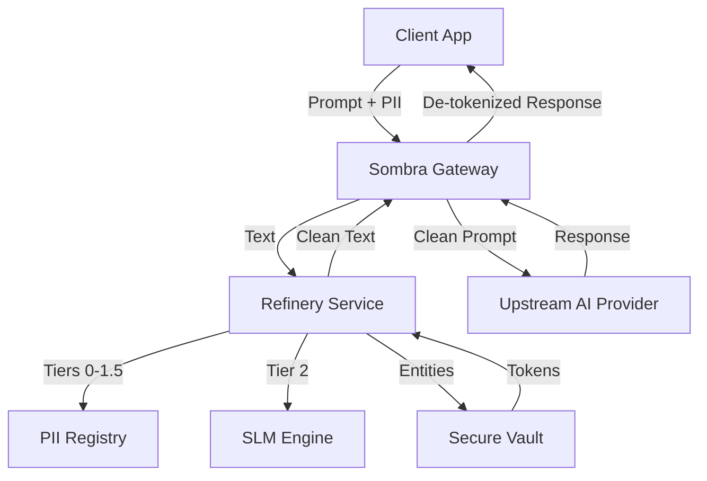

# 🏗️ Architecture Overview

OCULTAR is a **Zero-Egress PII Refinery** designed to bridge the gap between internal sensitive data and external AI providers. The system is built on a "Zero-Trust for Data" model, ensuring that PII is never exposed to untrusted environments.

## Core Design Principles

1.  **Zero-Egress**: All PII detection and tokenization happen within your trust boundary. No network calls are made to third-party detection providers.
2.  **Fail-Closed**: If any part of the refinery fails (e.g., SLM timeout, vault failure), the system blocks the request rather than risking data exposure.
3.  **Deterministic Tokenization**: Input PII is hashed (HMAC-SHA256) to produce consistent tokens securely keyed to the deployment, allowing for privacy-safe analytical joins without de-tokenization.

---

## The Big Picture

The OCULTAR ecosystem consists of several specialized components:

### 🛡️ [The Sombra Gateway](./sombra.md)
The entry point for all traffic. Sombra handles authentication, rate limiting, and orchestrates the refinement process before forwarding requests to upstream AI providers.

### 🧪 [Multi-Tier Refinery Pipeline](./refinery-pipeline.md)
A defense-in-depth pipeline that processes text through multiple layers:
- **Tier 0-1.5**: Deterministic rules, regex, and checksum-validated patterns (IBAN, Credit Cards, etc.).
- **Tier 2**: AI-powered Named Entity Recognition (NER) using local Small Language Models (SLM).
- **Tier 3**: Structural heuristics and contextual expansion.

### 🔐 [Security & Trust Model](./security-model.md)
How OCULTAR guarantees data safety, including:
- **AES-256-GCM** Vault encryption.
- **SSRF Protection** for upstream calls.
- **Ed25519** Signed Audit Logs for tamper-proof traceability.

---

## Data Flow

---

## Component Map

| Component | Path | Language | Responsibility |
|-----------|------|----------|----------------|
| **Sombra** | `/apps/sombra` | Go | Gateway & Orchestration |
| **Refinery** | `/services/refinery` | Go | PII Detection Engine |
| **SLM Engine**| `/apps/slm-engine` | Python | AI-powered NER (Tier 2) |
| **Vault** | `/services/vault` | Go | Secure PII Storage |
