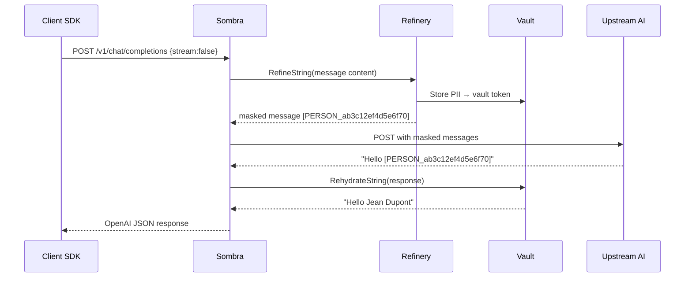
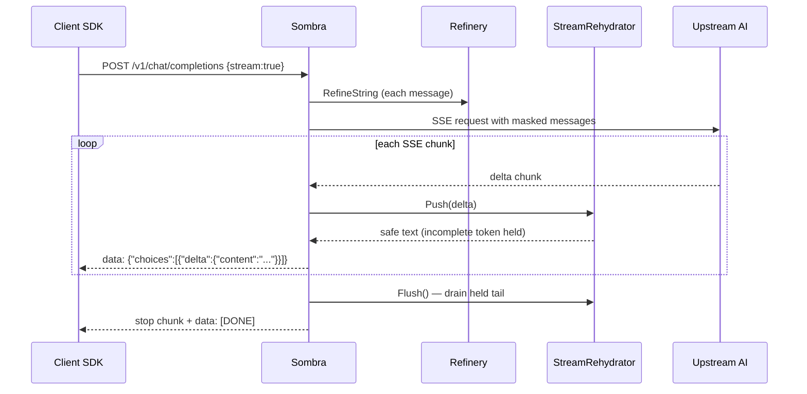

# The Sombra Gateway

Sombra is the agentic API gateway for the Ocultar ecosystem. It is a drop-in replacement
for the OpenAI API: any OpenAI-compatible SDK can point `OPENAI_BASE_URL` at Sombra and
every prompt is scrubbed before it reaches any upstream model.

## Responsibilities

1. **API Surface** — OpenAI-compatible `/v1/chat/completions` (buffered + real SSE streaming) and legacy `/query`.
2. **PII Scrub on Ingress** — each message content run through `Refinery.RefineString` before routing; raw PII never reaches any adapter.
3. **Multi-Model Routing** — maps client model aliases to provider adapters; enforces a domain allow-list (fail-closed).
4. **Actor Authentication** — Bearer token validated against `OCU_JWT_SECRET`; dev mode accepts any Bearer value when the secret is unset.
5. **Response Rehydration** — vault tokens in responses replaced with originals before delivery; streaming uses a boundary-aware buffer so tokens spanning chunk boundaries are never forwarded incomplete.
6. **Immutable Audit** — Ed25519-signed `sombra_audit.log`, one entry per completion, `SUCCESS` or `FAILED`.

---

## Endpoints

| Method | Path | Description |
|--------|------|-------------|
| `POST` | `/v1/chat/completions` | OpenAI-compatible (buffered + streaming) |
| `POST` | `/query` | Legacy single-prompt endpoint |
| `POST` | `/v1/slack/events` | Slack Events API connector |
| `GET`  | `/healthz` | Returns vault count + licence tier |
| `POST` | `/v1/entities` | Register a named entity with variants |
| `GET`  | `/v1/entities` | List all registered canonical entities |
| `POST` | `/v1/entities/seed` | Bulk-seed entities from a roster |

Default listen port: **8086** (`SOMBRA_PORT` to override).

---

## Registered Model Adapters

All four cloud adapters implement the `Streamer` interface for true token-level streaming.
The `LocalAdapter` works with Ollama, llama.cpp, and LM Studio.

| Client alias | Provider | Upstream ID |
|---|---|---|
| `gemini-flash-latest` | Google Gemini | `gemini-2.0-flash` |
| `gpt-4o` | OpenAI | `gpt-4o` |
| `gpt-4o-mini` | OpenAI | `gpt-4o-mini` |
| `mistral-large-latest` | Mistral (OpenAI-compat) | `mistral-large-latest` |
| `claude-sonnet-4-6` | Anthropic | `claude-sonnet-4-6` |
| `local-slm` | Ollama / llama.cpp | via `SLM_SIDECAR_URL` (commented out by default; uncomment in `main.go` to enable) |

---

## Request Lifecycle — Buffered Path

## Request Lifecycle — Streaming Path

The `StreamRehydrator` (`pkg/handler/stream_rehydrator.go`) holds any text from the last `[`
that could be the opening of a vault token until the closing `]` arrives. Markdown brackets
like `[link text]` (lowercase) pass through immediately.

---

## Zero-Egress Guarantee

`Router.SendStream` checks `isApprovedDomain(adapter.Endpoint(), r.allowedDomains)` before
dispatching. If the adapter's endpoint is not in the allow-list, the request is rejected with
`OCULTAR Zero-Egress Block` — no fallback, no partial send.

Default approved domains: `generativelanguage.googleapis.com`, `api.openai.com`,
`api.mistral.ai`, `api.anthropic.com`, `127.0.0.1`.

---

## Configuration

| Variable | Description |
|----------|-------------|
| `OCU_MASTER_KEY` | Master key for vault AES-256-GCM encryption (required in prod) |
| `OCU_JWT_SECRET` | Bearer token secret; unset = dev mode (any value accepted) |
| `OCU_VAULT_PATH` | DuckDB vault file path (default: `sombra_vault.db`) |
| `SOMBRA_PORT` | Listen port (default: `8086`) |
| `OPENAI_API_KEY` | OpenAI key |
| `ANTHROPIC_API_KEY` | Anthropic key |
| `GEMINI_API_KEY` | Google Gemini key |
| `MISTRAL_API_KEY` | Mistral key |
| `SLM_SIDECAR_URL` | Local SLM NER sidecar (default: `http://localhost:8085`) |
| `SOMBRA_MOCK_AI_URL` | Register a mock AI adapter for offline testing |
